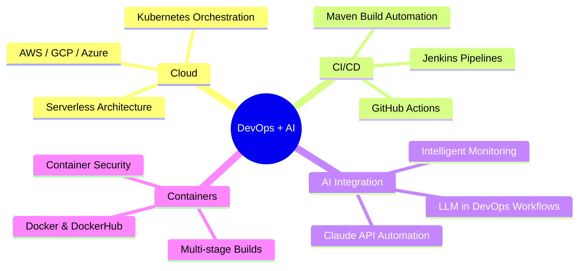

<div align="center">


[](https://git.io/typing-svg)

<br/>


[](https://github.com/kirantej860-bit)
[](https://linkedin.com/in/kirantej860)

</div>

---

## 🧑‍💻 About Me

```yaml
👤  Name        : M Tej Kiran
💼  Role        : DevOps Engineer & Full Stack Developer
📍  Location    : Bangalore, India 🇮🇳
🌐  Website     : gotit4all.com
🎯  Expertise   : Cloud | CI/CD | Docker | Kubernetes | AI Integration
🤝  Status      : Open to DevOps + AI Engineering Opportunities 🚀
💡  Philosophy  : "Automate everything. Deploy anywhere. Scale infinitely."
```

---

## 🛠️ Tech Stack

### ☁️ Cloud & Infrastructure
<p align="left">
  
  
  
  
</p>

### 🐳 DevOps & CI/CD
<p align="left">
  
  
  
  
  
  
</p>

### 🤖 AI & Machine Learning
<p align="left">
  
  
  
  
  
</p>

### 💻 Languages & Frameworks
<p align="left">
  
  
  
  
  
</p>

### 🗄️ Databases & Monitoring
<p align="left">
  
  
  
  
</p>

---

## 🚀 Featured Projects

<div align="center">

| 🗂️ Project | 🛠️ Tech | 📝 Description |
|---|---|---|
| [🐳 DockerHub → GitHub](https://github.com/kirantej860-bit/dockerhub-to-github) | Docker, GitHub Actions | Pull images from DockerHub & push to GitHub registry |
| [☕ Java Docker + Maven](https://github.com/kirantej860-bit/java-project-docker) | Java, Docker, Maven | Containerized Java app with Maven build automation |
| [🔄 Jenkins CI Pipeline](https://github.com/kirantej860-bit/jenkins-ci-to-github) | Jenkins, CI/CD | Automated CI pipeline with GitHub integration |
| [🌐 Docker Web App](https://github.com/kirantej860-bit/dockerwebapp) | Docker, Web | Dockerized web application deployment |
| [⚙️ Java Docker Maven](https://github.com/kirantej860-bit/javadocker-with-maven) | Java, Docker, CSS | Maven-powered Java containerization project |

</div>

---

## 📊 GitHub Stats

<div align="center">


</div>

---

## 🏆 GitHub Trophies

<div align="center">
  
</div>

---

## 📈 Contribution Graph

<div align="center">
  
</div>

---

## 🎯 Current Focus



---

## 📫 Connect With Me

<div align="center">

[](https://linkedin.com/in/kirantej860)
[](https://github.com/kirantej860-bit)
[](https://gotit4all.com)
[](mailto:kirantej860@gmail.com)

</div>

---

<div align="center">


*⭐ If my work inspires you, consider starring my repositories — it means a lot!*

</div>
<!-- updated: 2026-05-26T17:06:49Z -->
